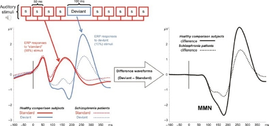

# 第一部分——神经现象MNN（Mismatch Negativity失匹配负波）的神经学分析
## 一、定义与理论基础

失匹配负波（MMN）是由重复刺激序列中偶然出现的、与标准刺激有可辨别差异的偏差刺激所诱发的一种持续时间较短、极性为负的事件相关电位。
MNN最早被Näätänen 等（1978）通过听觉oddball实验范式发现与命名。其属于事件相关电位。其可在听觉（Yue et al. 2017）、视觉（Kovarski et al. 2017）、体觉（Akatsuka et al. 2007）、嗅觉（Krauel et al. 1999）等多种模态中存在，是研究认知功能、感知记忆和异常检测机制的重要神经电生理指标。
MMN属于脑电（EEG）——大量锥体细胞同步产生的突触后电位总和在大脑皮层或头皮表面的反映——中的事件相关电位（ERP）——与大脑高级功能相关的、由外部刺激诱发的、与刺激具有锁时关系的生物电活动。而先前提到的oddball实验范式则是指通过进行大概率呈现的标准刺激和一个或多个以小概率呈现的偏差刺激，来检测参与者对重复标准刺激中的“oddballs”做出反应的实验，其通常会引发对情境新奇性的注意力反应。

## 二、神经机理分析

对于MMN的产生机制存在三种假说：模型调整假说、神经元适应假说和预编码假说。 模型调整假说是早期的记忆痕迹假说的延续，其认为MMN是偏差刺激违背习得规律而引起错误感知的标志（Garrido et al. 2009）。神经元适应假说认为，MMN是由标准刺激与偏差刺激间的物理差异及神经元群不应性引起的（Jääskeläinen et al. 2004）。预编码假说包容了前述两种不同假说（Garrido et al. 2008），其认为MMN既反映了的新颖事件导致的预测错误，又与预测模型更新过程相关联。
在神经发生源上，听觉MMN主要源于颞上回（初级和次级听觉皮层），额叶（前扣带回、额下回等）也参与其产生，尤其是与注意转换和预测更新相关的部分。视觉MMN主要位于枕叶视觉皮层。体觉MMN则源于体感皮层。小脑、丘脑、下丘、海马等皮质下结构也可能参与MMN的生成，尤其是多模态信息整合过程中。
分子与递质机制是，NMDA受体被认为在MMN产生中起关键作用，其功能异常会导致MMN波幅降低。GABA则被认为能抑制性中间神经元通过调节兴奋-抑制平衡，影响MMN的生成。在实验中谷氨酸-GABA系统的失衡与精神分裂症等疾病的MMN异常密切相关。

## 三、研究方法及过往研究

在任务设计上主要采用oddball范式进行研究，被试通常处于非注意状态（如阅读、观看视频），以排除注意力干扰，通过差异波提取MMN成分。
在实验中主要采用主要使用脑电图（EEG） 或脑磁图（MEG）进行数据采集，其中MEG在空间定位上更具优势，尤其对颞叶源。
在数据分析时，首先分别对“标准”和“偏差”刺激的脑电/脑磁反应进行多次叠加平均，得到两种事件相关电位/场。此后求取差异波——将“标准”的平均波形从“偏差”的平均波形中减去，得到的差异波中，在特定时间窗内出现的负向偏转即为MMN。此外有时还会进行源定位操作：结合结构磁共振（MRI），利用等效电流偶极子（ECD） 或最小范数估计（MNE） 等方法，对MMN的发生源进行空间定位。现代研究常与功能磁共振（fMRI） 结合，进行多模态验证。
例如在精神病性疾病中病理生理学相关研究（Yash B. Joshi,2019）中的结果图像所表示的那样



早期波形代表了对重复标准刺激（S）反应事件相关电势与罕见偏差刺激之间的差异。负向屈折表示负性错配（MMN），健康志愿者有典型反应（实线），精神分裂症患者MMN振幅减少（虚线）。在此实验中作者获取实验数据最多的范式，是由音调、音量、音色和持续时间等偏差特质诱发的。
此外还有（E. Neustadter，2016）研究中显示精神分裂症患者与健康对照组MMN反应的差异波形的实验结果：


## 四、研究的现实意义

MMN是研究精神分裂症最稳健、最特异的神经生理学指标之一：
从方法学角度看，MMN具有多项特征，使其成为精神分裂症研究中有前景的生物标志物（E. Neustadter等，2016）。例如在哺乳动物研究中对猴子（Javitt等，1992）和小鼠（如Umbricht等，2005）的研究，此外还被用作非人灵长类精神分裂症模型中的感觉和认知功能的神经生理指标（Gil-da-Costa等，2013）。
MMN可在人类中同样可以轻松评估，常被作为重复测量的特征。在健康对照组和精神分裂症患者中，曾表现出较高的测试-重测信度（Light等，2012）。此外，由于MMN是有意识产生的，所需任务极少，且可在低功能患者中可靠评估。
此外MMN还有以下特征适合作为医学领域研究中的指标：存在于未患病的一级亲属中；与患者的临床症状严重程度（如幻觉妄想）关联较弱，更反映稳定的特质性缺陷；在情感性精神障碍、强迫症等疾病中不明显，对精神分裂症谱系更具特异性；MMN缺损程度与病程长短相关，提示其可能追踪皮层（进行性的神经病理改变。
同时，在临床医学上，其可以通过MMN波幅预测未来向精神病的转化可能和转化时间，同时基线MMN特征可以预测患者对认知矫正治疗（CR）或社会技能训练的反应。

## 五、扩展应用与未来方向

MMN在跨模态与跨物种比较研究领域的应用价值，以开展视、听、体、嗅多模态MMN研究，揭示不同感觉通道的异常检测机制，同时通过比较生理学方法，探讨MMN在进化过程中的功能保守性与适应性变化的研究形式体现。而在医疗领域，特别是精准医疗与转化应用部分上，我们可以开发基于MMN的个性化治疗预测模型，用于精神疾病早期干预与药物开发。当然还有在人工智能与脑机接口领域中，研究并应用MMN在神经调控与认知增强中的作用的扩展。

# 第二部分——Hierarchical Predictive Coding Network: 模拟 Mismatch Negativity (MMN)

本项目实现了一个基于 **Hierarchical Predictive Coding (分层预测编码)** 的人工神经网络模型，旨在模拟神经科学中的 **Mismatch Negativity (MMN)** 现象。通过构建一个包含显式“预测误差”计算单元的循环神经网络，我们展示了模型如何对违反统计规律的“Oddball”刺激产生更强的神经反应（即预测误差信号）。

## 1. 项目简介

**Mismatch Negativity (MMN)** 是一种脑电图 (EEG) 成分，通常在受试者听到一系列标准声音中突然出现的偏差声音（Oddball）时产生。MMN 被广泛认为是大脑进行自动预测处理的证据：大脑不断生成对感觉输入的预测，当实际输入与预测不符时，会产生“预测误差”信号。

本项目旨在通过计算模型复现这一现象：
- **现象**：对罕见刺激（Oddball）的反应显著高于常见刺激（Standard）。
- **机制**：利用预测编码框架，模型学习序列的统计规律，Oddball 产生的高预测误差即对应 MMN 信号。

## 2. 神经科学背景

### Predictive Coding (预测编码)
预测编码理论认为，大脑是一个贝叶斯预测机器。
- **Top-down Prediction**: 高层脑区向低层发送预测信号。
- **Bottom-up Error**: 低层脑区计算实际感觉输入与预测之间的差异（Prediction Error），并将此误差向上传递以更新内部模型。

### Precision & Attention (精度与注意)
- **Precision (精度)**：反映了预测误差的可靠性。
- 在神经实现上，Precision 通常被建模为误差信号的**增益 (Gain)**。高 Precision 意味着误差信号被放大（即注意力集中），从而对内部模型的更新产生更大影响。

## 3. 方法

### 3.1 数据生成 (Oddball Paradigm)
我们使用合成数据模拟 Oddball 实验范式：
- **Standard Token (A)**: 高频出现 (e.g., p=0.9)。
- **Oddball Token (B)**: 低频出现 (e.g., p=0.1)。
- 序列示例：`A A A A B A A A B A ...`
- 支持 **Context Switch**：模拟环境统计规律的突然改变（例如 A 变罕见，B 变常见）。

### 3.2 模型结构

#### Predictive Coding RNN (PC-RNN)
受 Rao & Ballard (1999) 及 Friston 理论启发，我们设计了一个简化的分层循环网络：
1.  **State Unit (Layer 2)**: 维护内部状态 $h_t$ (GRU)，生成对下一时刻输入的预测 $\hat{x}_{t+1}$。
2.  **Error Unit (Layer 1)**: 接收真实输入 $x_t$ 和预测 $\hat{x}_t$，计算预测误差 $e_t$。
    $$ e_t = x_t - \hat{x}_t $$
3.  **Precision Control**: 引入增益参数 $G$ (Gain)。
    $$ e'_t = G \cdot e_t $$
4.  **Update**: 误差信号 $e'_t$ 被送入 State Unit 更新内部模型。

#### Baseline RNN
作为对照，我们使用一个标准的 GRU 网络进行 Next-token Prediction。它没有显式的误差计算单元，直接将输入 $x_t$ 映射到状态 $h_t$。其“惊奇”反应通过 Cross-Entropy Loss 估算。

## 4. 实验设置

- **框架**: PyTorch
- **优化器**: Adam
- **损失函数**: Cross Entropy (用于训练预测准确性)
- **评估指标**: Prediction Error (L2 Norm) 时间序列

### 运行环境
- Python 3.x
- PyTorch, NumPy, Matplotlib, Seaborn

## 5. 结果展示

*(注：运行代码后，图像将生成在 `outputs/figs/` 目录下)*

### 5.1 预测误差时间序列
下图展示了模型在处理 Oddball 序列时的预测误差（模拟神经反应）。可以看到，在 Oddball (红色点) 出现时，模型产生了显著的误差峰值，而对 Standard (绿色点) 的反应则被抑制（Repetition Suppression）。


### 5.2 Oddball 效应统计
统计结果显示，Oddball 诱发的平均误差显著高于 Standard，成功复现了 MMN 效应。


### 5.3 Precision (Gain) 的调节作用
通过调节增益参数 (Gain)，我们模拟了“注意力”对失配反应的调节。结果显示，随着 Gain 增加，Oddball 引起的误差反应被非线性放大。


## 6. 讨论

- **模型与生物学的对应**：本模型中的 $e_t$ 对应于感觉皮层（如听觉皮层）中 Error Neuron 的发放率。Standard 刺激由于被准确预测，误差被抑制；Oddball 刺激导致预测失败，激活 Error Neuron。
- **局限性**：当前模型是离散符号预测，而真实听觉输入是连续的频谱特征。
- **未来方向**：
    - 扩展到连续变量预测 (MSE Loss)。
    - 引入更深层的层级结构 (Hierarchical RNN)。
    - 与真实 EEG MMN 波形进行形态学对比。

## 7. 复现指南

### 安装依赖
```bash
pip install -r requirements.txt
```

### 步骤 1: 训练模型
训练 Predictive Coding 模型：
```bash
python src/train.py --model_type pc --epochs 100 --p_oddball 0.1 --gain 1.0
```
(可选) 训练 Baseline 模型：
```bash
python src/train.py --model_type baseline --epochs 20 --p_oddball 0.1
```

### 步骤 2: 评估与绘图
运行评估脚本，生成误差曲线和统计图：
```bash
# 评估 PC 模型并运行 Gain Sweep
python src/eval.py --model_type pc --p_oddball 0.1 --do_sweep

# 评估 Baseline 模型
python src/eval.py --model_type baseline --p_oddball 0.1
```

### 结果查看
所有生成的图片和模型权重保存在 `outputs/` 文件夹中。
