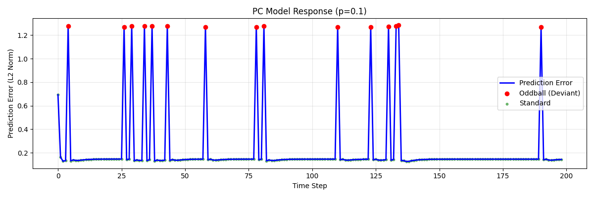
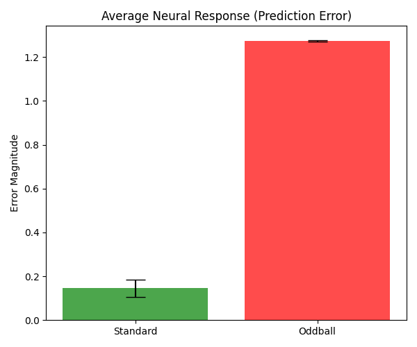
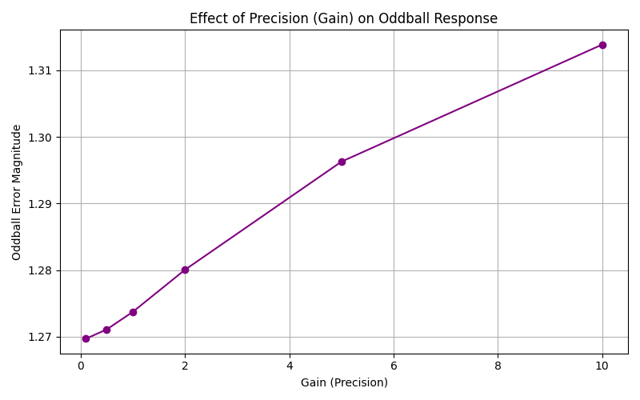

# Hierarchical Predictive Coding Network: 模拟 Mismatch Negativity (MMN)

本项目实现了一个基于 **Hierarchical Predictive Coding (分层预测编码)** 的人工神经网络模型，旨在模拟神经科学中的 **Mismatch Negativity (MMN)** 现象。通过构建一个包含显式“预测误差”计算单元的循环神经网络，我们展示了模型如何对违反统计规律的“Oddball”刺激产生更强的神经反应（即预测误差信号）。

## 1. 项目简介

**Mismatch Negativity (MMN)** 是一种脑电图 (EEG) 成分，通常在受试者听到一系列标准声音中突然出现的偏差声音（Oddball）时产生。MMN 被广泛认为是大脑进行自动预测处理的证据：大脑不断生成对感觉输入的预测，当实际输入与预测不符时，会产生“预测误差”信号。

本项目旨在通过计算模型复现这一现象：
- **现象**：对罕见刺激（Oddball）的反应显著高于常见刺激（Standard）。
- **机制**：利用预测编码框架，模型学习序列的统计规律，Oddball 产生的高预测误差即对应 MMN 信号。

## 2. 神经科学背景

### Predictive Coding (预测编码)
预测编码理论认为，大脑是一个贝叶斯预测机器。
- **Top-down Prediction**: 高层脑区向低层发送预测信号。
- **Bottom-up Error**: 低层脑区计算实际感觉输入与预测之间的差异（Prediction Error），并将此误差向上传递以更新内部模型。

### Precision & Attention (精度与注意)
- **Precision (精度)**：反映了预测误差的可靠性。
- 在神经实现上，Precision 通常被建模为误差信号的**增益 (Gain)**。高 Precision 意味着误差信号被放大（即注意力集中），从而对内部模型的更新产生更大影响。

## 3. 方法

### 3.1 数据生成 (Oddball Paradigm)
我们使用合成数据模拟 Oddball 实验范式：
- **Standard Token (A)**: 高频出现 (e.g., p=0.9)。
- **Oddball Token (B)**: 低频出现 (e.g., p=0.1)。
- 序列示例：`A A A A B A A A B A ...`
- 支持 **Context Switch**：模拟环境统计规律的突然改变（例如 A 变罕见，B 变常见）。

### 3.2 模型结构

#### Predictive Coding RNN (PC-RNN)
受 Rao & Ballard (1999) 及 Friston 理论启发，我们设计了一个简化的分层循环网络：
1.  **State Unit (Layer 2)**: 维护内部状态 $h_t$ (GRU)，生成对下一时刻输入的预测 $\hat{x}_{t+1}$。
2.  **Error Unit (Layer 1)**: 接收真实输入 $x_t$ 和预测 $\hat{x}_t$，计算预测误差 $e_t$。
    $$ e_t = x_t - \hat{x}_t $$
3.  **Precision Control**: 引入增益参数 $G$ (Gain)。
    $$ e'_t = G \cdot e_t $$
4.  **Update**: 误差信号 $e'_t$ 被送入 State Unit 更新内部模型。

#### Baseline RNN
作为对照，我们使用一个标准的 GRU 网络进行 Next-token Prediction。它没有显式的误差计算单元，直接将输入 $x_t$ 映射到状态 $h_t$。其“惊奇”反应通过 Cross-Entropy Loss 估算。

## 4. 实验设置

- **框架**: PyTorch
- **优化器**: Adam
- **损失函数**: Cross Entropy (用于训练预测准确性)
- **评估指标**: Prediction Error (L2 Norm) 时间序列

### 运行环境
- Python 3.x
- PyTorch, NumPy, Matplotlib, Seaborn

## 5. 结果展示

*(注：运行代码后，图像将生成在 `outputs/figs/` 目录下)*

### 5.1 预测误差时间序列
下图展示了模型在处理 Oddball 序列时的预测误差（模拟神经反应）。可以看到，在 Oddball (红色点) 出现时，模型产生了显著的误差峰值，而对 Standard (绿色点) 的反应则被抑制（Repetition Suppression）。



### 5.2 Oddball 效应统计
统计结果显示，Oddball 诱发的平均误差显著高于 Standard，成功复现了 MMN 效应。



### 5.3 Precision (Gain) 的调节作用
通过调节增益参数 (Gain)，我们模拟了“注意力”对失配反应的调节。结果显示，随着 Gain 增加，Oddball 引起的误差反应被非线性放大。



## 6. 讨论

- **模型与生物学的对应**：本模型中的 $e_t$ 对应于感觉皮层（如听觉皮层）中 Error Neuron 的发放率。Standard 刺激由于被准确预测，误差被抑制；Oddball 刺激导致预测失败，激活 Error Neuron。
- **局限性**：当前模型是离散符号预测，而真实听觉输入是连续的频谱特征。
- **未来方向**：
    - 扩展到连续变量预测 (MSE Loss)。
    - 引入更深层的层级结构 (Hierarchical RNN)。
    - 与真实 EEG MMN 波形进行形态学对比。

## 7. 复现指南

### 安装依赖
```bash
pip install -r requirements.txt
```

### 步骤 1: 训练模型
训练 Predictive Coding 模型：
```bash
python src/train.py --model_type pc --epochs 100 --p_oddball 0.1 --gain 1.0
```
(可选) 训练 Baseline 模型：
```bash
python src/train.py --model_type baseline --epochs 20 --p_oddball 0.1
```

### 步骤 2: 评估与绘图
运行评估脚本，生成误差曲线和统计图：
```bash
# 评估 PC 模型并运行 Gain Sweep
python src/eval.py --model_type pc --p_oddball 0.1 --do_sweep

# 评估 Baseline 模型
python src/eval.py --model_type baseline --p_oddball 0.1
```

### 结果查看
所有生成的图片和模型权重保存在 `outputs/` 文件夹中。
